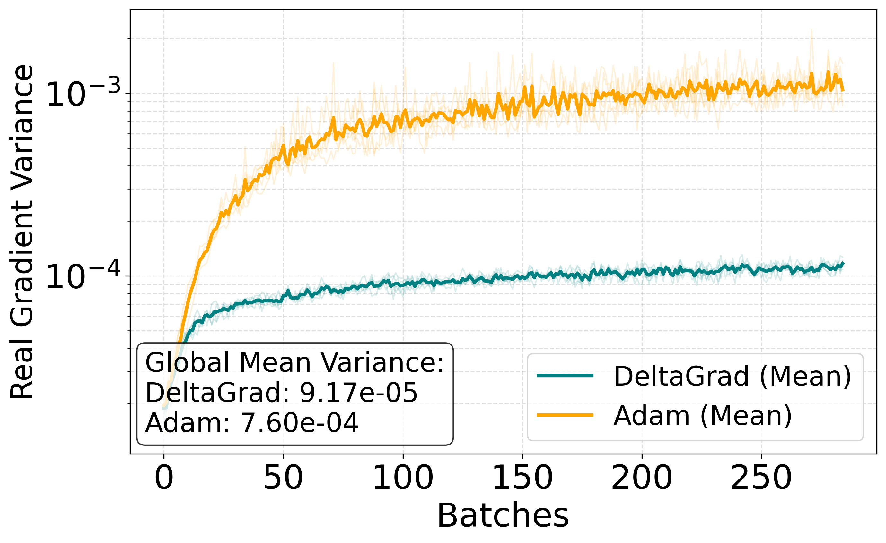

# DeltaGrad: Towards Robust Deep Learning via Adaptive Gradient

[📄 Read the Paper (PDF)](paper/DeltaGrad_Extended_Abstract.pdf) | [📊 View Results](results/)


---

This repository contains the official implementation of **DeltaGrad**, an adaptive optimizer designed to mitigate noise memorization and gradient instability in non-convex optimization. By introducing a dynamic **Reliability Metric ($R_t$)**, the framework modulates updates based on instantaneous gradient coherence.

---

## 📂 Project Organization

The repository is modularly structured to ensure experimental transparency and extensibility:

* **`DeltaGrad.py`**: Implementation of the $R_t$ metric and Windowed Inertia logic.
* **`engine.py`**: Standardized training and evaluation logic across all test regimes.
* **`model.py`**: Compact ConvNet architecture used for all benchmarks.
* **`tune_hyperparams.py`**: Automated Hyperparameter Optimization suite using **Optuna**.
* **`visualizations.py`**: Has all functions relatable with visualizing results.
* **`analyse.py`**: Simple script to save visualizations.
* **`final_benchmark.py`**: Primary script to execute Learning Rate Stress, Batch Size, and Data Noise tests.
* **📂 `best_params/`**: Serialized optimal hyperparameters from the Optuna studies.
* **📂 `results/`**: Comprehensive storage for raw experimental results and generated performance analytics.

---

## 💻 Environment Requirements

To ensure reproducibility of the benchmarks, the following environment is recommended:

* **Python**: 3.8 or higher.
* **Core Libraries**: 
    * `torch >= 1.10.0`
    * `torchvision >= 0.11.0`
    * `numpy >= 1.21.0`
    * `joblib` (for model serialization and persistence)
* **Optimization & Analysis**: 
    * `optuna >= 2.10.0` (for hyperparameter tuning) 
    * `scipy` (used for statistical calculations and Pearson correlation)
* **Visualization**:
    * `matplotlib` (for result visualization and log processing)
    * `seaborn` (for statistical data visualization and matrices)
* **Dataset**: CIFAR-100 (automatically handled via `torchvision`).

---

### Installation

To install all required dependencies at once, run the following command in your terminal:

```bash
pip install torch torchvision numpy optuna joblib scipy matplotlib seaborn
```
---

## 📚 Citation

If you utilize this implementation or the DeltaGrad framework in your research, please cite:

```latex
@article{oneill2026deltagrad,
  title={DeltaGrad: Towards Robust Deep Learning via Adaptive Gradient},
  author={O'Neill Mendes, Alexandre},
  journal={GitHub Repository},
  year={2026},
  note={Preprint},
  url = {https://github.com/xandasoneill/deltagrad_optimizer}
}
```