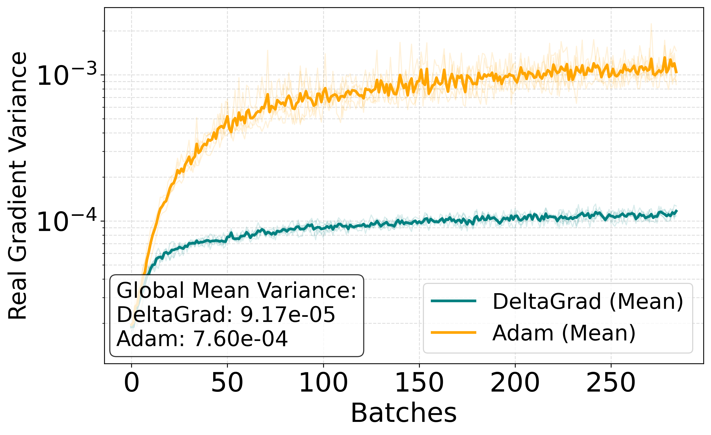

# DeltaGrad: Towards Robust Deep Learning via Adaptive Gradient

[📄 Read the Paper (PDF)](paper/DeltaGrad_Extended_Abstract.pdf) | [📋 Read the Plan (PDF)](deltagradpaperplan.pdf) | [📊 View Results](results/)


---

This repository contains the official implementation of **DeltaGrad**, an adaptive optimizer designed to mitigate noise memorization and gradient instability in non-convex optimization. By introducing a dynamic **Reliability Metric ($R_t$)** based on instantaneous gradient coherence, the framework modulates parameter update steps. Two formulations are implemented, per [`deltagradpaperplan.pdf`](deltagradpaperplan.pdf):

* **Windowed (finite horizon)** -- $R_t$ from a fixed $K$-step window of past gradient disagreement.
* **EMA (infinite horizon)** -- $R_t$ from an exponentially-decayed running disagreement estimate, with 6 selectable transform options (exponential decay recommended).

---

## 📂 Project Organization

```
deltagrad/            importable library
  optimizers/           DeltaGradWindowed, DeltaGradWindowedLegacy, DeltaGradEMA, baselines
  models.py              ConvNet5Layer, ConvNet3Stage, LogisticRegression, MLP2Layer, MNISTVAE
  data/                  CIFAR-100/10, MNIST, IMDB-BoW loaders + label-noise injection
  training.py            generalized train/eval engine + gradient-variance instrumentation
  viz.py                 all result-plotting functions
  yolo/                  DeltaGrad wired into ultralytics YOLO training (unrelated side project)

experiments/          runnable scripts + configs (one ExperimentConfig per paper Table 1 row)
  configs.py             TASK_REGISTRY -- the source of truth for every benchmark's setup
  run_task.py            generic CLI: --task <name> --optimizer <name> [--smoke]
  run_cifar100_lr_stress.py   1x/3x/10x LR-multiplier stress test
  ablation_*.py          state-memory footprint / wall-clock overhead / beta_phi sweep
  sweep_r_transforms.py  runs one task under all 6 DeltaGrad-EMA R-transforms (Sec 3.2)
  tune_hyperparams.py    Optuna tuning for any optimizer against any TASK_REGISTRY task
  analyse.py             loads two saved results .pkl files and generates comparison figures
  extended/              ResNet+ImageNet-1K / NanoGPT scaffolds (Sec 4.2 -- not yet implemented)

tests/                pytest suite: optimizer correctness, baselines, data loaders, smoke runs
archive/              superseded/dead code and old discarded results, kept not deleted
results/              results/<task>/<optimizer>_results.pkl + figures, per new run
                      results/legacy/ holds everything from before this reorg
best_params/          Optuna-tuned hyperparameters (best_params/windowed/ = current schema)
optuna_studies/       full Optuna study objects
notebooks/            colab_bootstrap.ipynb  -- Drive-mount + run experiments on Colab GPU
                      tune_hyperparams.ipynb -- pick a task, run Optuna over the optimizers
                                                you care about, write best_params/
                      analyze_results.ipynb  -- loads results/ and works through the plan's
                                                claims: variance reduction, the R_t mechanism
                                                and its 6 transforms, seed stability,
                                                significance, overhead, noise memorization
paper/                extended abstract + poster PDFs
deltagradpaperplan.pdf   the spec this implementation follows
```

---

## 💻 Environment Requirements

* **Python**: 3.8 or higher.
* **Core Libraries**:
    * `torch >= 1.10.0`
    * `torchvision >= 0.11.0`
    * `numpy >= 1.21.0`
    * `joblib` (for model serialization and persistence)
* **Optimization & Analysis**:
    * `optuna >= 2.10.0` (for hyperparameter tuning)
    * `scipy` (used for statistical calculations and Pearson correlation)
* **Visualization**:
    * `matplotlib` (for result visualization and log processing)
    * `seaborn` (for statistical data visualization and matrices)
* **Testing**: `pytest` (for the suite under `tests/`)
* **Dataset**: CIFAR-100/CIFAR-10/MNIST (via `torchvision`, auto-downloaded); IMDB (raw Stanford tarball, auto-downloaded, no extra dependency).

### Installation

```bash
pip install -e .
```

This installs the `deltagrad` and `experiments` packages plus their core dependencies (from `pyproject.toml`). For the bonus YOLO integration (`deltagrad/yolo/`), install the optional extra:

```bash
pip install -e ".[yolo]"
```

Or, without an editable install, just `pip install -r requirements.txt` and run scripts as modules from the repo root (`python -m experiments.run_task ...`).

---

## 🚀 Running Experiments

Every core benchmark from `deltagradpaperplan.pdf` Table 1 is registered in `experiments/configs.py::TASK_REGISTRY` and runnable via one generic CLI:

```bash
python -m experiments.run_task --task cifar100_noise_20 --optimizer windowed
python -m experiments.run_task --task mnist_vae --optimizer ema
```

`--optimizer` accepts `windowed`, `ema`, or any baseline (`adam`, `adamw`, `sgd_momentum`, `adagrad`, `rmsprop`). Add `--smoke` to run a fast local sanity check (tiny subset, 1-2 epochs) instead of the full Table-1-accurate config -- useful for verifying a change works before a full Colab run.

Other entry points:

```bash
python -m experiments.run_cifar100_lr_stress --optimizer windowed      # 1x/3x/10x LR stress test
python -m experiments.ablation_state_memory                            # (K+1)d / 3d / 2d footprint check
python -m experiments.ablation_wallclock --optimizers windowed ema adam
python -m experiments.ablation_beta_phi_sweep
python -m experiments.sweep_r_transforms --task mnist_logreg           # all 6 Sec 3.2 R-transforms
python -m experiments.tune_hyperparams --task cifar100_noise_20        # Optuna, all 7 optimizers
python -m experiments.analyse --baseline-results <path> --deltagrad-results <path>
```

Tuned hyperparameters are written to `best_params/<task>/<optimizer>.pkl`; pass
`--use-tuned` to `run_task.py` to benchmark with them instead of the config defaults.

### Tuning hyperparameters

`notebooks/tune_hyperparams.ipynb` is the interactive front end for the same tuner:
pick a task, pick optimizers, see the search space and an estimate of the wall clock
before committing to it, then watch the trials land. Add `--resume` (CLI) or leave
`RESUME = True` (notebook) to keep each study in `optuna_studies/<task>/tuning.db`,
so an interrupted sweep continues from its finished trials instead of restarting;
`--n-trials` is then the study's total budget rather than a number of extra trials.

Scoring uses a validation split carved out of the *training* set -- the task's test
loader is never built during tuning, so tuned hyperparameters cannot leak test-set
information into the benchmark that later reports on them.

### Analysing results

`notebooks/analyze_results.ipynb` reads `results/<task>/<optimizer>_results.pkl` and
covers each claim in the plan in its own section, for any number of optimizers at
once. Two optional instrumentation flags feed it:

```bash
# throttle the gradient-variance probe (8 extra fwd/bwd passes per measurement)
python -m experiments.run_task --task cifar100_noise_20 --optimizer windowed --grad-variance-every 50

# record DeltaGrad-EMA's (S_hat, R) operating points for the Sec 3.2 transform plots
python -m experiments.run_task --task mnist_logreg --optimizer ema --sample-transform-every 50
```

Sampling is off by default, strided rather than random so it draws no global RNG,
and verified in `tests/` to leave an identically-seeded run bit-for-bit unchanged.

Run the test suite with:

```bash
pytest
```

(Network-marked tests -- a real IMDB download check -- are deselected by default; run with `pytest -m network` to include them.)

---

## 📚 Citation

If you utilize this implementation or the DeltaGrad framework in your research, please cite:

```latex
@article{oneill2026deltagrad,
  title={DeltaGrad: Towards Robust Deep Learning via Adaptive Gradient},
  author={O'Neill Mendes, Alexandre},
  journal={GitHub Repository},
  year={2026},
  note={Preprint},
  url = {https://github.com/xandasoneill/deltagrad_optimizer}
}
```
